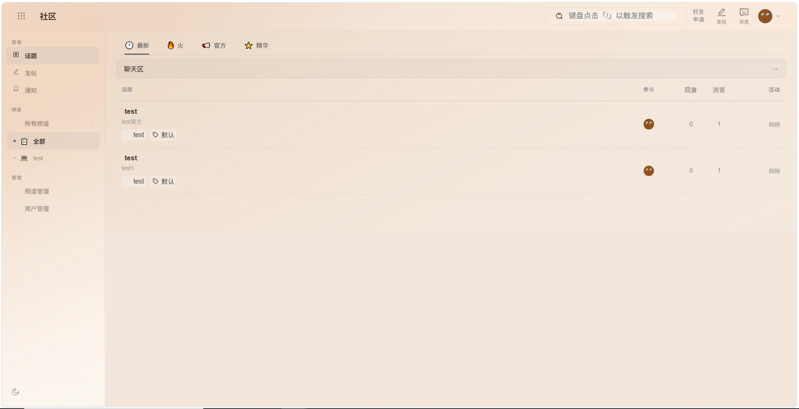
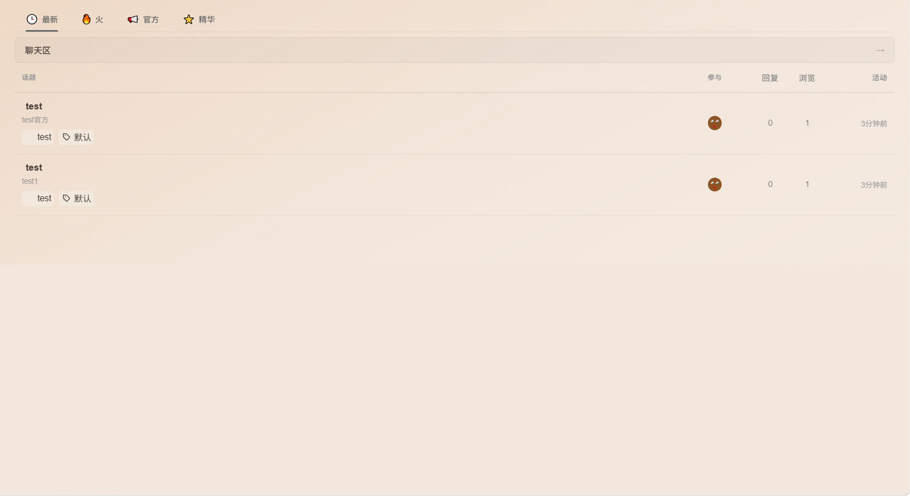
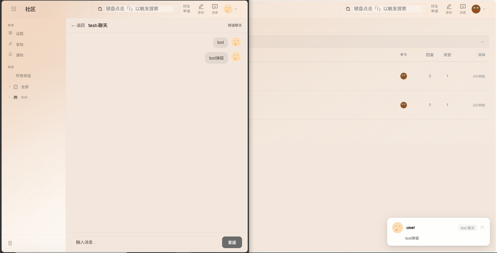
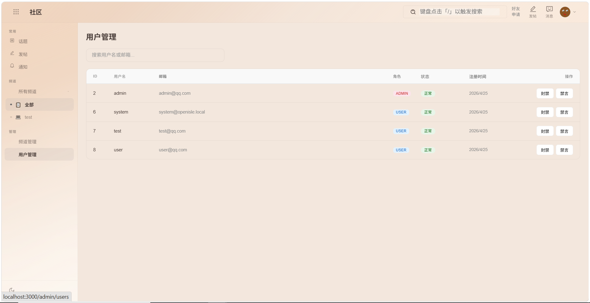
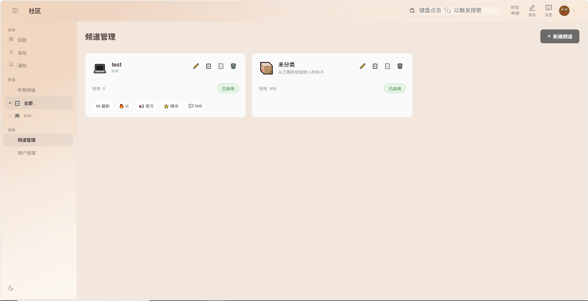

<p align="center">
  <br>
  基于 OpenIsle 二次开发的社区平台
  <br><br><br>
</p>

## 💡 简介

[你的项目名] 是一个基于 OpenIsle 二次开发的全栈技术社区平台，使用 Spring Boot + Vue 3 构建。  
原项目提供了用户注册、OAuth 登录、贴文发布、评论交互等基础功能，本项目在此基础上进行了大量定制优化，**专注于运维技术交流、客户支持和外包服务对接场景**。

## 🔧 基于原项目的定制改动

- 重新设计首页布局
- 优化帖子分类体系
- 增强消息通知系统
- 增加1级频道与2级子频道
- 增加用户管理
- 增加频道管理

## 🖼️ 产品截图








## ✨ 原项目已有功能

- JWT 认证及多种 OAuth 登录
- 支持分类、标签的贴文管理及草稿保存
- 嵌套评论、点赞/点踩系统
- 全局搜索，支持内容和用户检索
- 图片上传（默认使用腾讯云 COS）
- 浏览器推送通知，离站也能收到提醒
- 通过环境变量灵活调整配置

## 🚀 快速部署

详细部署指南见 （待补充）。

```bash
# 克隆项目
git clone [你的仓库地址]

# 后端配置
cd backend
cp .env.example .env
# 编辑 .env 填入数据库、OAuth等信息
mvn spring-boot:run

# 前端配置
cd frontend
npm install
npm run dev
